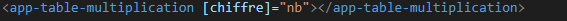
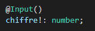

<h1>Multiplication</h1>
L’exercice de programmation que l’on vous propose a pour objectif de vous permettre de
consolider les premiers concepts présentés dans les premiers TD d’introduction à Angular.

<h1>Perequis</h1>
Introduction
L’exercice de programmation que l’on vous propose a pour objectif de vous permettre de
consolider les premiers concepts présentés dans les premiers TD d’introduction à Angular.

● Environnement de travail opérationnel  
● Savoir créer un projet Angular avec des composants. 
● Avoir réalisé les TD jusqu’à 2.3 
● Avoir compris les modes d’échanges entre Parent et Enfant d’élément du DOM 

<h1>Etape 1</h1>
Nous avons mit un formulaire dans notre component 

La directive ngIf permet d’insérer ou de retirer un élément à partir d’une condition qui peut être vraie ou fausse.

va permettre de recuperer la valeur de chiffre
 
J'ai aussi modifier le app.component.ts

j'ai commencer par lié la balise <form> à la variable identForm grâce à la directive formGroup ainsi que pour formGroupe:

nous avons ensuite initialiser le composant et ensuite definie la variable identForm!

va permettre d'initié le formGroupe

Dans le table-multiplication.component.ts 

j'ai importer un input , 

je les ensuite initié avec :

chiffre est le nom de notre varaible , number est son type.

cette variable va permttre de faire les calcul de 1 a 10, suite a ca nous allons faire une boucle 

Dans le table-multiplication.html njous allons tous simplement retrouver la methode qui va permetre deffectuer les calcules

<h1>Partie 2 / UML</h1>
Je n'est pas eu le temp deffectuer la partie deux par manque de temp et car j'ai prit beaucoup de temp a comprendre le fonctionnement et je n'est pas eu le temp de faire L'UML je suis desoler
<h1>Conclusion</h1>

Je suis conscient du manque d'investissements car ce projet n'était pas dur non plus , si j'arrive à obtenir ce BTS  je sais que je ne continuerai pas dans la programmation mais je me dirigerai plus dans le design. Cependant je continuerai à faire des efforts malgré que je ne suis pas un passionné de programmation et que mon niveau est loin d'etre bon car je sais que plus tard même dans le design certaine notion seront importants comme le JS par exemple.
Ca me tenner a coeur de vous le dire.
